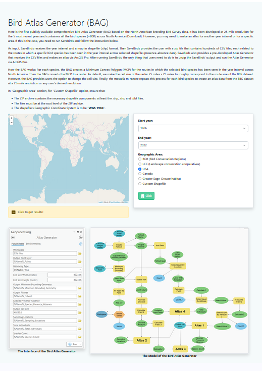
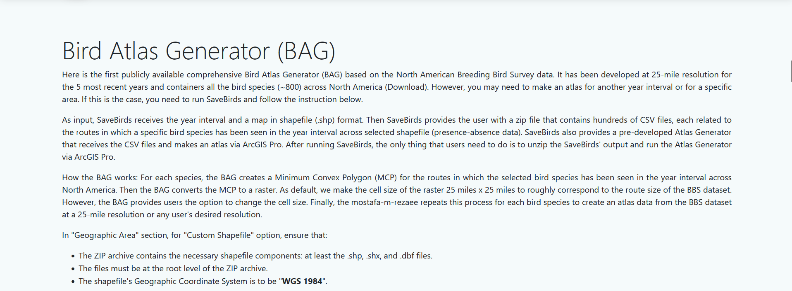
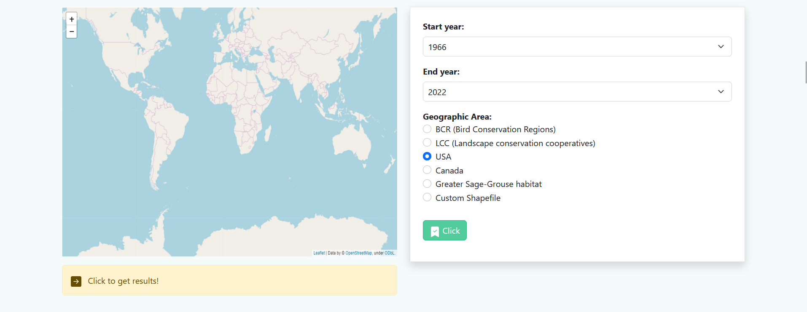
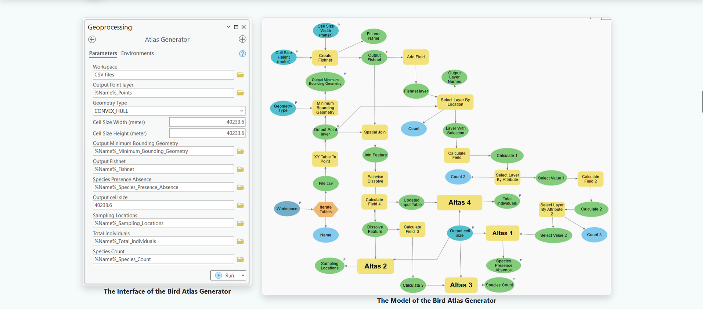

<h1 align="center">SaveBirds.app Bird Atlas Generator (BAG)</h1>

# 1. Overview
Create the Bird Atlas Generator (BAG) page for SaveBirds.app using Vue 3 and Bootstrap 5. This tool allows users to generate comprehensive bird atlases for specific geographic areas and time periods, providing valuable insights for conservation and research efforts.

# 2. Design Requirements

## 2.1. Layout Structure
The Bird Atlas Generator page should consist of three main sections:
- **Explanation Section**: Title and descriptive text explaining the feature
- **Form Inputs Section**: User selection controls for data parameters
- **Map Viewer Section**: Interactive map display with controls

## 2.2. Visual Reference





# 3. Component Specifications

## 3.1. Explanation Section
- **Title**:
  - Text: "Bird Atlas Generator"
  - Font: Large, bold, prominent
  - Position: Top of the content area

- **Descriptive Text**:
  - Content: Comprehensive explanation of the Bird Atlas Generator and its functionality
  - Length: 2-3 paragraphs explaining:
    - Purpose of the Bird Atlas Generator
    - Types of data it provides
    - How the results can be used for conservation
    - How to use the form controls to generate results
  - Font: Clean, readable font consistent with the rest of the site
  - Position: Below the title

## 3.2. Form Inputs Section
- **Containing Element**:
  - Style: Card or panel with light background
  - Border: Subtle rounded border or shadow
  - Padding: Sufficient spacing around form elements

- **Form Controls**:
  - **Start Year Dropdown**:
    - Label: "Start year"
    - Options: Range from 1966 to current year
    - Default: 1966
    - Requirement: Must be implemented as a dropdown select control
  
  - **End Year Dropdown**:
    - Label: "End year"
    - Options: Synchronized with Start year (equal to or greater than selected start year)
    - Default: Current year
    - Requirement: Must be implemented as a dropdown select control
  
  - **Geographic Area Radio Buttons**:
    - Label: "Geographic Area"
    - Options: "BCR", "LCC", "USA", "Canada", "Greater Sage-Grouse habitat", "Custom Shapefile"
    - Layout: Radio button group arranged in a clean layout
    - Default: "BCR"
  
  - **Submit Button**:
    - Text: "Click"
    - Icon: Green check icon or arrow
    - Color: Green (#28a745 or Bootstrap's .btn-success)
    - Position: Below the form controls
    - Action: Trigger map data loading and visualization

## 3.3. Map Viewer Section
- **Map Container**:
  - Size: Full width of the content area
  - Height: Appropriate height for good visibility (minimum 400px)
  - Border: Subtle border or shadow
  
- **Map Implementation**:
  - Library: Leaflet.js
  - Base Map: OpenStreetMap
  - Features:
    - Zoom controls (+ and - buttons)
    - Draggable/pannable map area
    - Responsive to different screen sizes
    - Support for displaying geographic boundaries based on selected area
  
- **Action Button**:
  - Text: "Click to get results!"
  - Color: Yellow or amber
  - Icon: Left-pointing arrow (arrow-left)
  - Position: Prominently placed on or near the map
  - Action: Trigger the generation and display of the bird atlas
  
- **Attribution**:
  - Text: "Leaflet | Data by OpenStreetMap, under ODbL"
  - Style: Small, subtle but readable
  - Position: Bottom of the map (typically right corner)

# 4. Interaction Flow

## 4.1. User Input Phase
1. User selects a start year from the dropdown
2. User selects an end year from the dropdown (must be ≥ start year)
3. User selects a geographic area option
4. User clicks the "Click" button to initiate the process

## 4.2. Map Visualization Phase
1. The appropriate geographic boundaries are displayed on the map based on the selected area
2. Map is interactive, allowing zoom, pan, and exploration of boundaries
3. User can click the "Click to get results!" button to generate the final atlas

## 4.3. Results Phase
1. The system generates a comprehensive bird atlas for the selected parameters
2. Results are displayed or made available for download

# 5. Responsive Behavior
- **Desktop View**:
  - Optimal layout with balanced sections
  - Map spans full width with appropriate height
  - All controls easily accessible without scrolling

- **Mobile View**:
  - Single-column layout with sections stacked vertically
  - Form inputs may use accordion or collapsible sections if needed
  - Map sized appropriately for mobile viewing
  - All interactive elements sized appropriately for touch input

# 6. Implementation Notes
- Create as a Vue component in `views/BirdAtlasGeneratorView.vue`
- Use Bootstrap 5 grid system for responsive layout
- Implement form controls using Vue's v-model for data binding
- Use Leaflet.js library for the interactive map (vue-leaflet can be considered)
- Ensure proper validation of form inputs before submission
- Implement loading indicators for map data retrieval
- Since this is a frontend-only implementation, mock the data visualization with static map examples

# 7. Data Handling
- Implement client-side validation for all form inputs
- Handle the synchronization between start and end year dropdowns
- Structure the component to emit events or call store actions on form submission
- Create mock data for different geographic areas to display on the map

# 8. Component Data Structure
```javascript
data() {
  return {
    startYear: 1966,
    endYear: 2022,  // Update to current year
    geographicArea: "BCR", // Default selection
    isLoading: false,
    mapReady: false,
    resultsReady: false,
    // Additional data properties as needed for map functionality
  }
}
```

# 9. Code Structure
- Use semantic HTML5 elements (`<section>`, `<form>`, etc.)
- Implement as a single-file component with template, script, and style sections
- Style using Bootstrap classes with minimal custom CSS
- Create smaller sub-components for complex form sections if needed
- Include appropriate comments for complex logic
- For any custom styles, use scoped CSS to avoid conflicts
